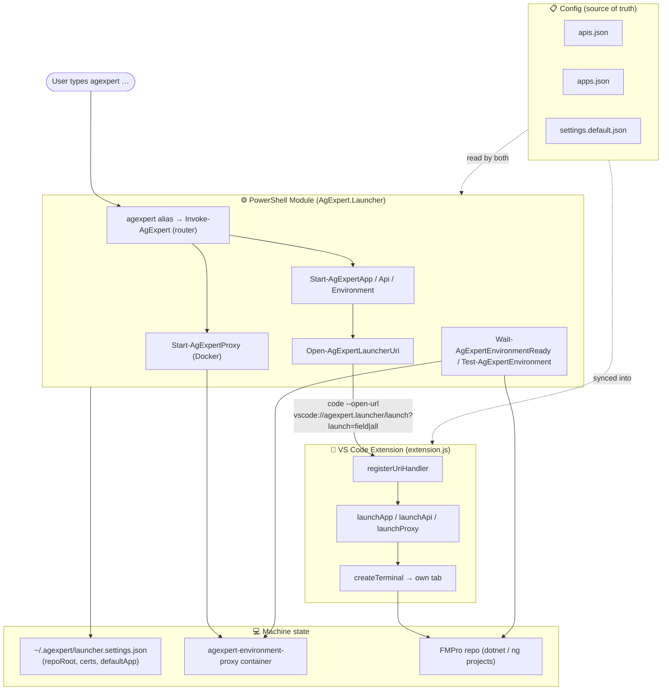

# AgExpert Launcher — Architecture

The launcher turns one-word commands like `agexpert start field` into the right set of VS Code
terminal tabs, running the correct projects against a containerized proxy. It has **four layers**
bound together by a **single source of truth**.



## 1. Config — the single source of truth

`config/apis.json` and `config/apps.json` describe every product (name, port, directory, default
profile, and flags like `proxyOnly` / `clientOnly`). **Both** the module and the extension read this
same config — the extension gets a synced copy at release time — so an API is never hardcoded in two
places. `config/settings.default.json` holds defaults, overlaid by machine settings at install time.

## 2. PowerShell module — the brain

The `agexpert` alias routes to `Invoke-AgExpert`, which interprets your words:

- **`agexpert field`** → front-end app → client + server
- **`agexpert mcCain api [Profile]`** → API-only product (requires the `api` suffix)
- **`agexpert start [app]`** → whole environment (client + server + proxy), using the saved
  `defaultApp` when omitted
- **`agexpert proxy [service] [action]`** → the Docker proxy
- **`agexpert --version`** (also `-v` / `version`) → report the installed build

The module makes *decisions* (which projects, which profile, is the port free) but does not open tabs
itself — it hands a route to the extension. It also manages the **proxy container** directly and polls
**readiness**.

## 3. The bridge — a launcher URI

The module never spawns terminals; instead `Open-AgExpertLauncherUri` calls `code --open-url` with
**one encoded parameter**:

```
vscode://agexpert.launcher/launch?launch=<name>|<target>|<profile>
```

Everything travels in that single `launch` parameter specifically because `code.cmd` splits on `&` —
a second query parameter would truncate the route.

## 4. VS Code extension — the hands

`extension.js` registers a URI handler, parses `name|target|profile`, looks up the product in the
synced config, and calls `createTerminal` for each piece. **Every terminal opens as its own standalone
tab** (no grouping or splitting). This is the layer that actually runs `dotnet run` /
`ng build --watch` in the right directory.

## End-to-end: `agexpert start field`

1. Alias → `Invoke-AgExpert start field` → `Start-AgExpertEnvironment field`
2. `Start-AgExpertApp field -Target all` → URI `field|all` → extension opens **client** + **server** tabs
3. `Open-AgExpertProxyTerminal` → URI `proxy` → extension opens **proxy** tab; `Start-AgExpertProxy`
   brings up the Docker container
4. `Wait-AgExpertEnvironmentReady` polls the proxy and app server port until green

## Supporting cast

- **Tooling** — `tools/install.ps1` deploys the module + agent + skills + settings and installs the
  newest `.vsix`; `tools/Build-AgExpertRelease.ps1` runs the analyzer + tests, syncs config into the
  extension, bumps both versions together, and packages/installs the `.vsix` (the version bump is what
  forces VS Code to load new code).
- **Tests** — Pester suites (`Registry`, `Routing`, `Environment`, `Extension`, `Syntax`) plus a Node
  harness that loads `extension.js` against a mocked VS Code API.
- **Machine settings** (`~/.agexpert/launcher.settings.json`) localize `repoRoot`, certificate paths,
  and `defaultApp`, and are never committed.

## Design rules that hold it together

- Config is authoritative — no duplication between the module and the extension.
- The module decides; the extension acts.
- Routes ride as one encoded parameter so `code.cmd` cannot truncate them.
- `Test` is the default launch profile, matching the proxy environment.
- APIs run `--no-restore` to skip the ~90s Azure Artifacts device-flow auth on startup.
- A local API and the proxy cannot share a port, so the launcher releases the proxy service first.
